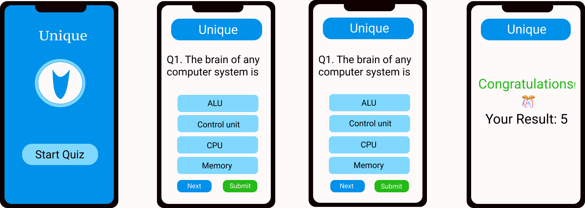

# Application Name
### Quiz-Application-Using-MongoDB

This Repo contains a Quiz Application which allows users to participate in Quiz and shows the result post submission. This App is developed during the learning process of Node Js, MongoDb and Express Js. Hosted in Heroku and Netlify.

## Description
The App shows multiple choice questions, user can select one option and go to next question using next button. All data is stored into the mongodb database. If you want end quiz then click on submit button and it displays score. User can again play quiz click on unique title.

## Technology

* HTML
* CSS
* JavaScript
* MongoDB, NodeJS, ExpressJS

## Design

 ## Authors: 

 * #### <a href="https://github.com/guruk05">Guru Prasath</a>
 * #### <a href="https://github.com/Pratikshatippe">Pratiksha Tippe</a> 

### Preview

https://awesome-shockley-5dbe6f.netlify.com

